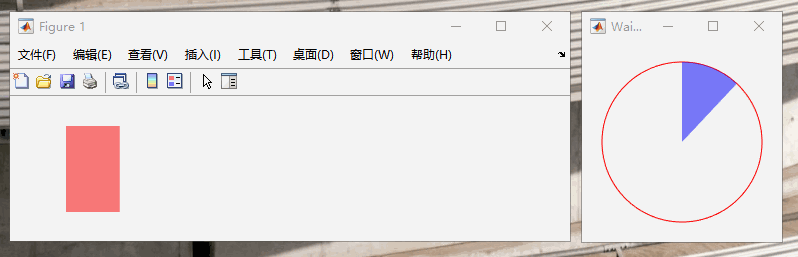

# WaitBar

一个 Matlab 程序，类似官方 `waitbar()` 函数功能，创建一个进度条图形对象，可以更自由的控制该对象出现的位置和表现行为。

## 特性

- 通过设置 'Parent' 参数可以把进度条嵌入到指定的父图形对象中去，包括 figure、uipanel、uitab；
- 可以选择进度条种类（目前支持矩形、圆形）；
- 可以指定进度条变化的方向（矩形支持四个方向，圆形支持两个方向）。

## 使用

### 1. 把 *WaitBarm* 文件拷贝到工作路径。

### 2. 创建进度条对象

在需要 waibar 的地方调用方法 h = WaitBar('PropertyName', propertyvalue)，返回进度条对象句柄。创建对象时可以设置其特性，可接收的参数名字以及值：

- Parent：想要进度条嵌入进去的图形对象，如不设置，自动创建新窗口；
- BarType：进度条类型（Bar-矩形、Pie-圆形）；
- FillColor：进度条填充颜色，接收标准Matlab颜色表达；
- Alpha：可以设置进度条填充颜色透明度，范围0-1；
- BorderStyle：进度条边框种类（'none'无边框 | '-'实线 | '--'虚线 | ':'点虚线 | '-.'点划线）
- BorderColor：设置边框线的颜色，接收标准Matlab颜色表达；
- Position：进度条在父对象中的位置，接收normalized参数，标准Matlab位置表达；
- Steps：进度条的阶数，默认100，也就是最小变化间隔为1/100；
- Percent：进度，[0-1]闭区间；
- Direction：变化方式，矩形可选lr-左到右，rl-右到左，bt-底到上，tb-上到底；圆形可选'lr'-顺时针，'rl'-逆时针。

### 3. 进度条进度更新

 在需要更新进度的地方调用 h.Update('PropertyName', propertyvalue,)。

- 第一个参数必须WaitBar()函数的返回值；
- 可以更新的参数名字包括'FillColor','Alpha','Alpha','BorderStyle','BorderColor','Percent';

## 测试举例

运行 *WaitBarTest()* 可以看到两个进度条的实现示例。

## License

MIT
